### 练习1

- 操作系统镜像文件ucore.img是如何一步一步生成的？

  运行指令 `make v= ` ，阅读其结果：

  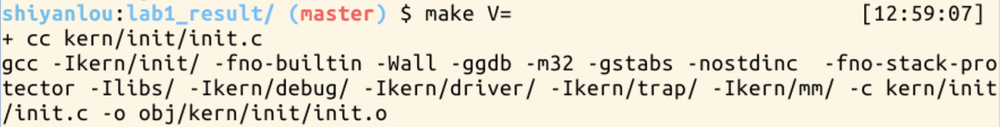

  发现调用了 GCC，ld，dd

  - make执行将所有的源代码编译成对象文件，并分别链接形成kernal，bootblock文件。

  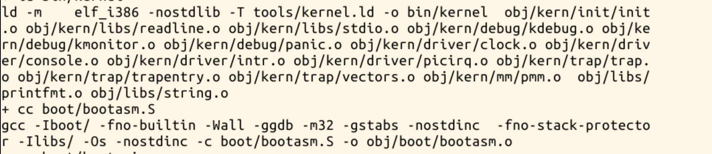

  - dd程序将c程序编译，转换成可执行文件，将Bootloader转移至虚拟硬盘ucore.img中

  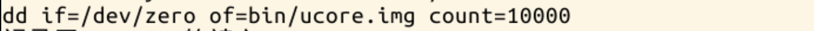

- 一个被系统认为是符合规范的硬盘主引导扇区的特征是什么？

  - 打开 sign.c

    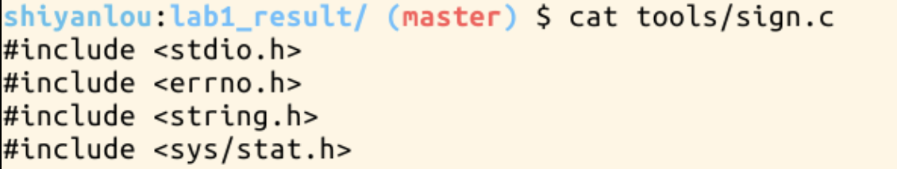

    可以发现：符合规范的MBR特征是其512字节数据的最后两个字节是 0x55、0xAA

    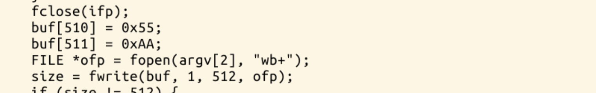

### 练习2

- 从CPU加电后执行的第一条指令开始，单步跟踪BIOS的执行。

  - 使用指令 `less` 进入Makefile，并查看相关代码

    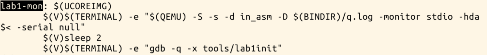

  - 查看lab1init的内容

    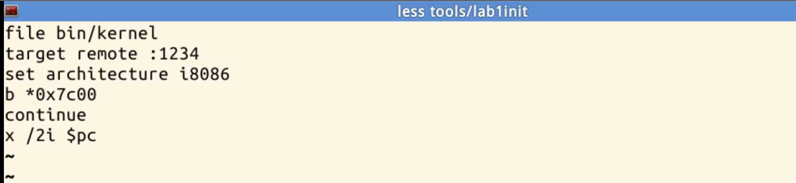

    - 加载符号
    - 连接qemu
    - BIOS进入8086的实模式
    - Bootloader第一条指令在0x7c00，打一个断点
    - 继续运行
    - 打印两条指令寄存器的地址

  - 执行指令 ` make lab1-mon` 

    - 进入QEMU

      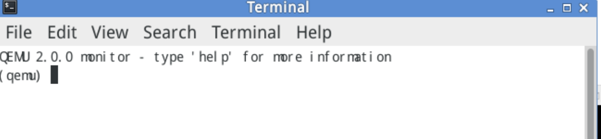

      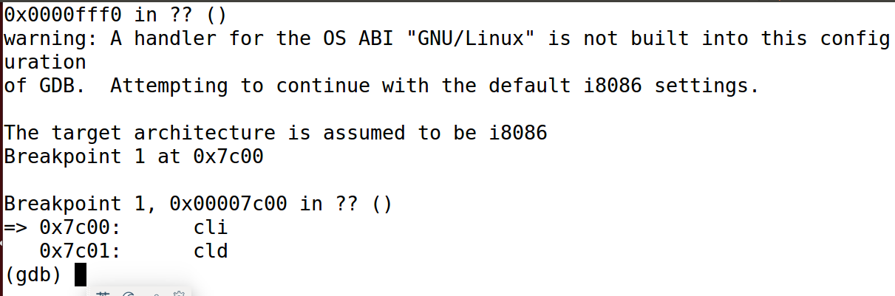
      
      单步跟踪完成

- 在初始化位置0x7c00设置实地址断点,测试断点正常。

  - 发现停在lab1init设置的断点0x7C00处

    - 此时执行窗口显示为：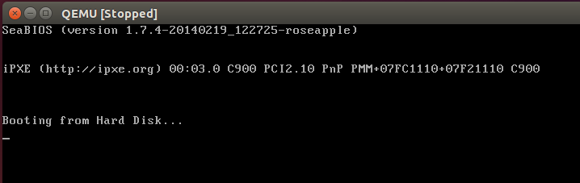

    - 输入指令continue，显示结果为：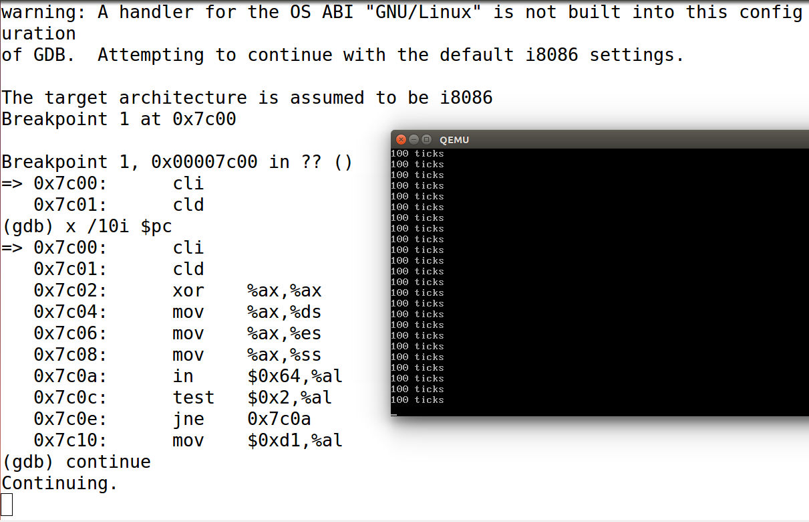

- 从0x7c00开始跟踪代码运行,将单步跟踪反汇编得到的代码与bootasm.S和 bootblock.asm进行比较。

  - 运行调试：

    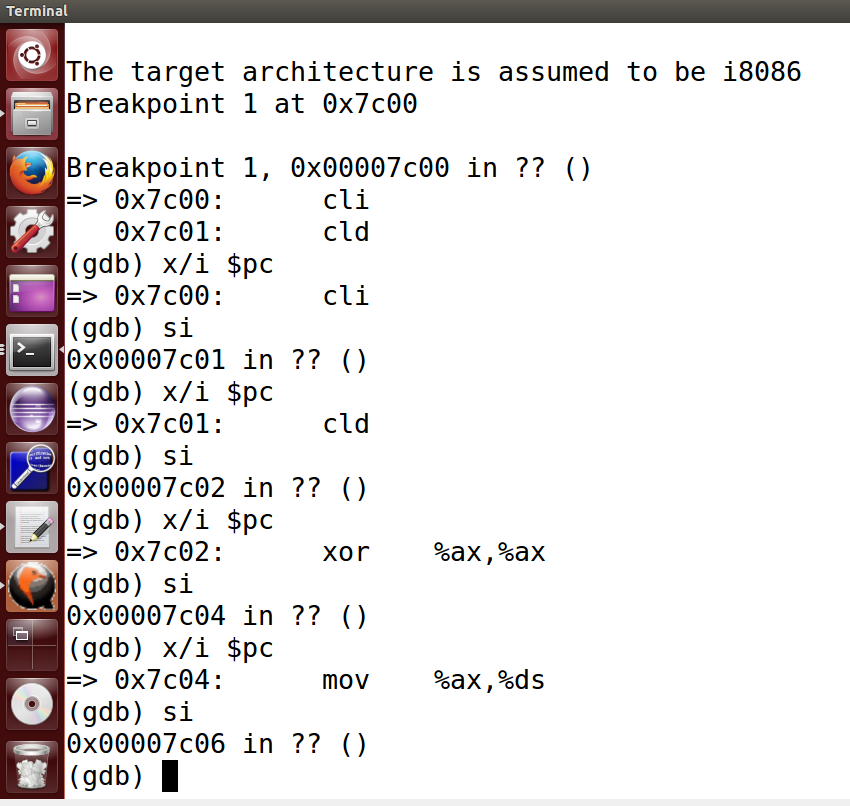

  - 查找bootblock.S中的代码：

    ```assembly
    start:
    .code16                                             # Assemble for 16-bit mode
        cli                                             # Disable interrupts
        cld                                             # String operations increment
    
        # Set up the important data segment registers (DS, ES, SS).
        xorw %ax, %ax                                   # Segment number zero
        movw %ax, %ds                                   # -> Data Segment
        movw %ax, %es                                   # -> Extra Segment
        movw %ax, %ss                                   # -> Stack Segment
    
        # Enable A20:
        #  For backwards compatibility with the earliest PCs, physical
        #  address line 20 is tied low, so that addresses higher than
        #  1MB wrap around to zero by default. This code undoes this.
    ```

  - 查找bootblock.asm中的代码：

    ```assembly
    start:
    .code16                                             # Assemble for 16-bit mode
        cli                                             # Disable interrupts
        7c00:   fa                      cli    
        cld                                             # String operations increment
        7c01:   fc                      cld    
    
        # Set up the important data segment registers (DS, ES, SS).
        xorw %ax, %ax                                   # Segment number zero
        7c02:   31 c0                   xor    %eax,%eax
        movw %ax, %ds                                   # -> Data Segment
        7c04:   8e d8                   mov    %eax,%ds
        movw %ax, %es                                   # -> Extra Segment
        7c06:   8e c0                   mov    %eax,%es
        movw %ax, %ss                                   # -> Stack Segment
        7c08:   8e d0                   mov    %eax,%ss
    ```

    观察后发现相同。

- 自己找一个bootloader或内核中的代码位置，设置断点并进行测试。

  - 将断点设置在0x7c12，进行测试：

    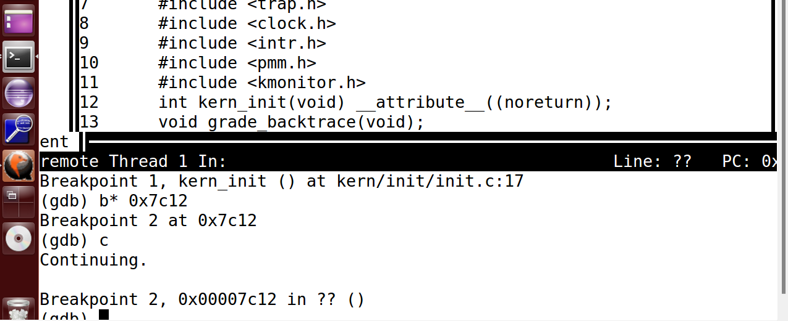

  - 查看运行的进程

    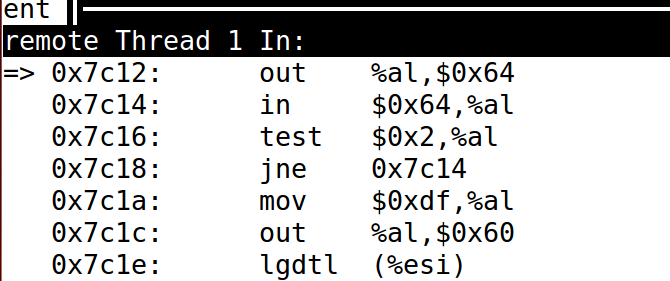

  - 可见其汇编代码相同，并在输入continue后qemu正常工作。

### 练习3

分析bootloader进入保护模式的过程。

#### 分析bootasm.S源代码：

##### 宏定义

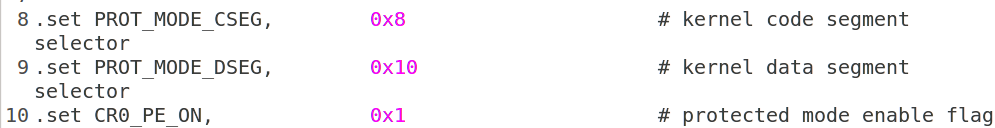

##### 关闭中断，将各个寄存器重置

修改控制方向标志寄存器DF=0，使得内存地址从低到高增加
它先将各个寄存器置0

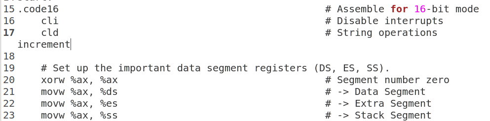

##### 开启A20

打开A20地址线

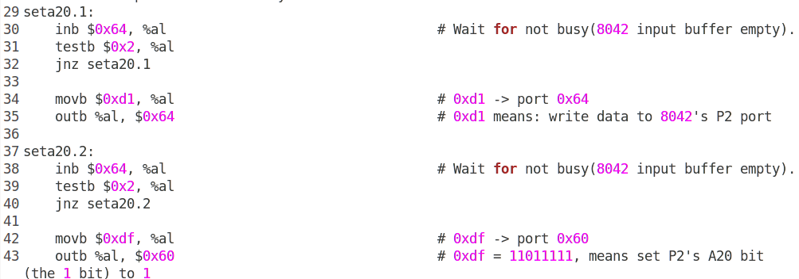

初始化GDT表

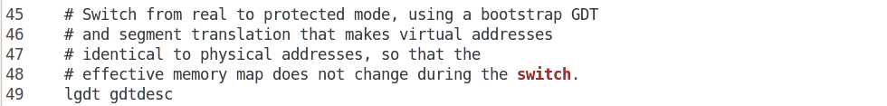

进入保护模式

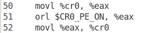

通过长跳转更新cs的基地址，设置段寄存器，并建立堆栈

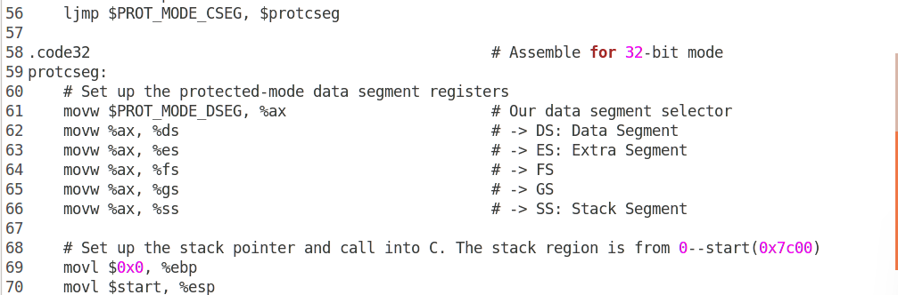转到保护模式完成，进入boot主方法


