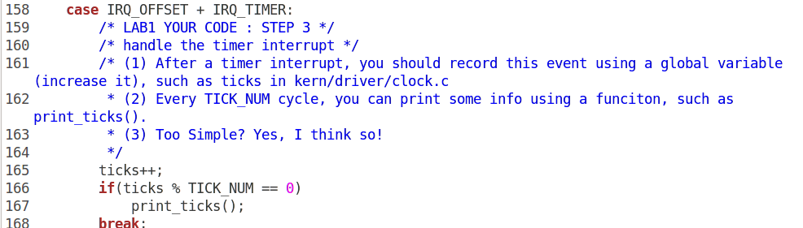

### 练习1

- 操作系统镜像文件ucore.img是如何一步一步生成的？

  运行指令 `make v= ` ，阅读其结果：

  

  发现调用了 GCC，ld，dd

  - make执行将所有的源代码编译成对象文件，并分别链接形成kernal，bootblock文件。

  

  - dd程序将c程序编译，转换成可执行文件，将Bootloader转移至虚拟硬盘ucore.img中

  

- 一个被系统认为是符合规范的硬盘主引导扇区的特征是什么？

  - 打开 sign.c

    

    可以发现：符合规范的MBR特征是其512字节数据的最后两个字节是 0x55、0xAA

    


### 练习2

- 从CPU加电后执行的第一条指令开始，单步跟踪BIOS的执行。

  - 使用指令 `less` 进入Makefile，并查看相关代码

    

  - 查看lab1init的内容

    

    - 加载符号
    - 连接qemu
    - BIOS进入8086的实模式
    - Bootloader第一条指令在0x7c00，打一个断点
    - 继续运行
    - 打印两条指令寄存器的地址

  - 执行指令 ` make lab1-mon` 

    - 进入QEMU

      

      
      
      单步跟踪完成

- 在初始化位置0x7c00设置实地址断点,测试断点正常。

  - 发现停在lab1init设置的断点0x7C00处

    - 此时执行窗口显示为：

    - 输入指令continue，显示结果为：

- 从0x7c00开始跟踪代码运行,将单步跟踪反汇编得到的代码与bootasm.S和 bootblock.asm进行比较。

  - 运行调试：

    

  - 查找bootblock.S中的代码：

    ```assembly
    start:
    .code16                                             # Assemble for 16-bit mode
        cli                                             # Disable interrupts
        cld                                             # String operations increment
    
        # Set up the important data segment registers (DS, ES, SS).
        xorw %ax, %ax                                   # Segment number zero
        movw %ax, %ds                                   # -> Data Segment
        movw %ax, %es                                   # -> Extra Segment
        movw %ax, %ss                                   # -> Stack Segment
    
        # Enable A20:
        #  For backwards compatibility with the earliest PCs, physical
        #  address line 20 is tied low, so that addresses higher than
        #  1MB wrap around to zero by default. This code undoes this.
    ```

  - 查找bootblock.asm中的代码：

    ```assembly
    start:
    .code16                                             # Assemble for 16-bit mode
        cli                                             # Disable interrupts
        7c00:   fa                      cli    
        cld                                             # String operations increment
        7c01:   fc                      cld    
    
        # Set up the important data segment registers (DS, ES, SS).
        xorw %ax, %ax                                   # Segment number zero
        7c02:   31 c0                   xor    %eax,%eax
        movw %ax, %ds                                   # -> Data Segment
        7c04:   8e d8                   mov    %eax,%ds
        movw %ax, %es                                   # -> Extra Segment
        7c06:   8e c0                   mov    %eax,%es
        movw %ax, %ss                                   # -> Stack Segment
        7c08:   8e d0                   mov    %eax,%ss
    ```

    观察后发现相同。

- 自己找一个bootloader或内核中的代码位置，设置断点并进行测试。

  - 将断点设置在0x7c12，进行测试：

    

  - 查看运行的进程

    

  - 可见其汇编代码相同，并在输入continue后qemu正常工作。


### 练习3

分析bootloader进入保护模式的过程。

#### 分析bootasm.S源代码：

##### 宏定义


##### 关闭中断，将各个寄存器重置

修改控制方向标志寄存器DF=0，使得内存地址从低到高增加
它先将各个寄存器置0


##### 开启A20

打开A20地址线


初始化GDT表


##### 进入保护模式


##### 通过长跳转更新cs的基地址，设置段寄存器，并建立堆栈

##### 转到保护模式完成，进入boot主方法


### 练习4

分析bootloader加载ELF格式的OS的过程

- bootloader如何读取硬盘扇区的？

  - bootloader让CPU进入保护模式后，下一步的工作就是从硬盘上加载并运行OS。考虑到实现的简单性，bootloader的访问硬盘都是LBA模式的PIO（Program IO）方式，即所有的IO操作是通过CPU访问硬盘的IO地址寄存器完成。

  - 实现代码：

    ```c
    /* waitdisk - wait for disk ready */
    static void waitdisk(void) {
        // 获取并判断磁盘是否处于忙碌状态
        while ((inb(0x1F7) & 0xC0) != 0x40)
            /* do nothing */;
    }
    /* readsect - read a single sector at @secno into @dst */
    static void readsect(void *dst, uint32_t secno) {
        // 等待磁盘准备就绪
        waitdisk();
        // 设置磁盘参数
        outb(0x1F2, 1);                         // 读取1个扇区
        outb(0x1F3, secno & 0xFF);              // 0x1F3-0x1F6 设置LBA模式的参数
        outb(0x1F4, (secno >> 8) & 0xFF);
        outb(0x1F5, (secno >> 16) & 0xFF);
        outb(0x1F6, ((secno >> 24) & 0xF) | 0xE0);
        outb(0x1F7, 0x20);                      // 设置磁盘命令为“读取”
        // 等待磁盘准备就绪
        waitdisk();
        // 从0x1F0端口处读数据
        insl(0x1F0, dst, SECTSIZE / 4);
    }
    ```

- bootloader是如何加载ELF格式的OS？

  - bootloader先将ELF格式的OS加载到地址`0x10000`。

    ```c
    readseg((uintptr_t)ELFHDR, SECTSIZE * 8, 0);
    ```

  - 之后通过比对ELF的magic number来判断读入的ELF文件是否正确。

  - 再将ELF中每个段都加载到特定的地址。

    ```c
    // load each program segment (ignores ph flags)
    ph = (struct proghdr *)((uintptr_t)ELFHDR + ELFHDR->e_phoff);
    eph = ph + ELFHDR->e_phnum;
    for (; ph < eph; ph ++)
        readseg(ph->p_va & 0xFFFFFF, ph->p_memsz, ph->p_offset);
    ```

  - 最后跳转至ELF文件的程序入口点(entry point)。

### 练习5

- 实现函数调用堆栈跟踪函数

  编写写代码 `print_stackframe(void)` 

  

  使用指令 `make qemu` 进行验证：

  ```c
  [~/OS_lab/labcodes/lab1]
  moocos-> make qemu
  + cc kern/debug/kdebug.c
  + ld bin/kernel
  10000+0 records in
  10000+0 records out
  5120000 bytes (5.1 MB) copied, 0.0554875 s, 92.3 MB/s
  1+0 records in
  1+0 records out
  512 bytes (512 B) copied, 0.000954689 s, 536 kB/s
  146+1 records in
  146+1 records out
  74871 bytes (75 kB) copied, 0.00255493 s, 29.3 MB/s
  (THU.CST) os is loading ...
  
  Special kernel symbols:
    entry  0x00100000 (phys)
    etext  0x001032e4 (phys)
    edata  0x0010ea16 (phys)
    end    0x0010fd20 (phys)
  Kernel executable memory footprint: 64KB
  ebp:0x00007b08 eip:0x001009a6 args:0x00010094 0x00000000 0x00007b38 0x00100092 
      kern/debug/kdebug.c:307: print_stackframe+21
  ebp:0x00007b18 eip:0x00100ca3 args:0x00000000 0x00000000 0x00000000 0x00007b88 
      kern/debug/kmonitor.c:125: mon_backtrace+10
  ebp:0x00007b38 eip:0x00100092 args:0x00000000 0x00007b60 0xffff0000 0x00007b64 
      kern/init/init.c:48: grade_backtrace2+33
  ebp:0x00007b58 eip:0x001000bb args:0x00000000 0xffff0000 0x00007b84 0x00000029 
      kern/init/init.c:53: grade_backtrace1+38
  ebp:0x00007b78 eip:0x001000d9 args:0x00000000 0x00100000 0xffff0000 0x0000001d 
      kern/init/init.c:58: grade_backtrace0+23
  ebp:0x00007b98 eip:0x001000fe args:0x0010331c 0x00103300 0x0000130a 0x00000000 
      kern/init/init.c:63: grade_backtrace+34
  ebp:0x00007bc8 eip:0x00100055 args:0x00000000 0x00000000 0x00000000 0x00010094 
      kern/init/init.c:28: kern_init+84
  ebp:0x00007bf8 eip:0x00007d68 args:0xc031fcfa 0xc08ed88e 0x64e4d08e 0xfa7502a8 
      <unknow>: -- 0x00007d67 --
  ++ setup timer interrupts
  ```

  将输出结果与答案验证，显示结果大致一致。

- 解释最后一行各个数值的含义
  - 最后一行是`ebp:0x00007bf8 eip:0x00007d68 args:0xc031fcfa 0xc08ed88e 0x64e4d08e 0xfa7502a8 `，共有ebp，eip和args三类参数，分别表示调用发生的文件、调用发生所在行和调用函数名。

### 练习6

- 完善中断初始化和处理

  - 在mmu.h中找到表项结构的定义：

    ```h
    /* Gate descriptors for interrupts and traps */
    struct gatedesc {
        unsigned gd_off_15_0 : 16;        // low 16 bits of offset in segment
        unsigned gd_ss : 16;            // segment selector
        unsigned gd_args : 5;            // # args, 0 for interrupt/trap gates
        unsigned gd_rsv1 : 3;            // reserved(should be zero I guess)
        unsigned gd_type : 4;            // type(STS_{TG,IG32,TG32})
        unsigned gd_s : 1;                // must be 0 (system)
        unsigned gd_dpl : 2;            // descriptor(meaning new) privilege level
        unsigned gd_p : 1;                // Present
        unsigned gd_off_31_16 : 16;        // high bits of offset in segment
    };
    ```

  - 该表项的大小为`16+16+5+3+4+1+2+1+16 == 8*8`bit，即**8字节**。

  - 根据IDT表项的结构，我们可以得知，IDT表项的第二个成员`gd_ss`为段选择子，第一个成员`gd_off_15_0`和最后一个成员`gd_off_31_16`共同组成一个段内偏移地址。根据段选择子和段内偏移地址就可以得出中断处理程序的地址。

- 编程完善kern/trap/trap.c中对中断向量表进行初始化的函数idt_init.

  - 代码如下：

    

- 编程完善trap.c中的中断处理函数trap，在对时钟中断进行处理的部分填写trap函数中处理时钟中断的部分，使操作系统每遇到100次时钟中断后，调用print_ticks子程序，向屏幕上打印一行文字”100 ticks”。

  - 代码如下：

    
